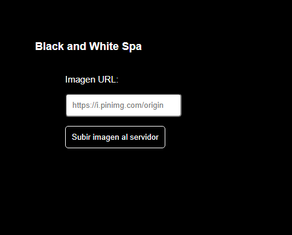

# Desafío Evaluado - Black and White

La empresa Black and White Spa está promocionando una campaña para las redes sociales
en donde quieren ofrecer un sitio web que permita escribir la URL de una imagen de internet
y que ésta sea procesada por el servidor para ser devuelta en blanco y negro.
Deberás crear un servidor que disponibilice una ruta raíz que devuelva un HTML con el
formulario para ingresar la URL de la imagen con estilos CSS de un documento interno en los
archivos del servidor. El formulario debe redirigir a otra ruta del servidor que procese la
imagen y la devuelva en blanco y negro. Como muestran las siguientes imágenes:

